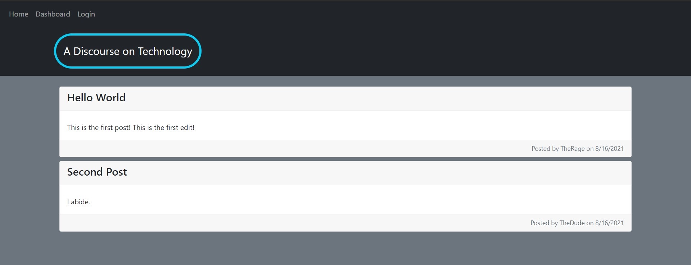
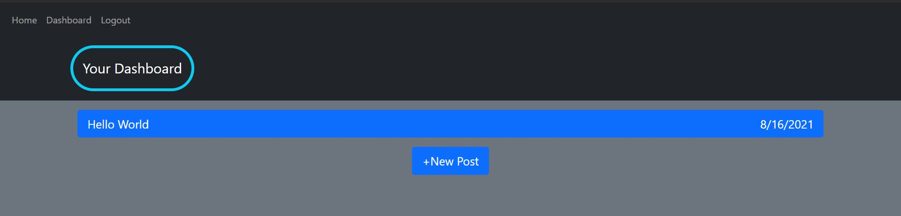

# Tech-Blog
Link to deployed app: https://a-tech-discourse.herokuapp.com/

## Description

A CMS-style blog site where all users can view Blog posts, registered users can publish blog posts and comment on other posts.

## Table of Contents

- [Usage](#usage)
- [Tests](#tests)
- [Questions](#questions)

## Usage

Visit [Link to Deployed App](https://a-tech-discourse.herokuapp.com/)
* Browse blog posts, log in to post.
* While logged in, view and edit your posts in the Dashboard

Homepage:

Dashboard:

## Technologies Used

* JavaScript
* Node.js
* Express.js
* Sequelize.js
* MySQL
* Handlebars.js
* dotenv
* bcrypt
* Bootstrap

## Questions

For any additional questions please reach out to me at:

[My Github Profile](https://github.com/AdrianCronin)

Email: [acronindev@gmail.com](mailto:acronindev@gmail.com)

